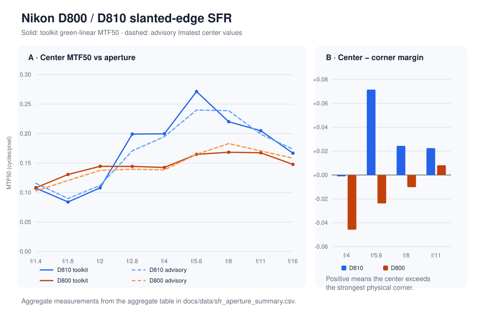
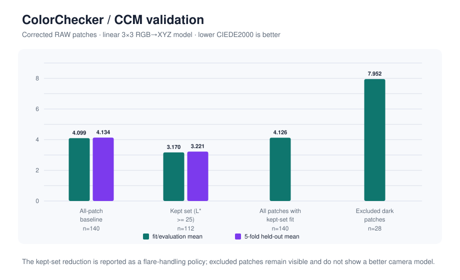
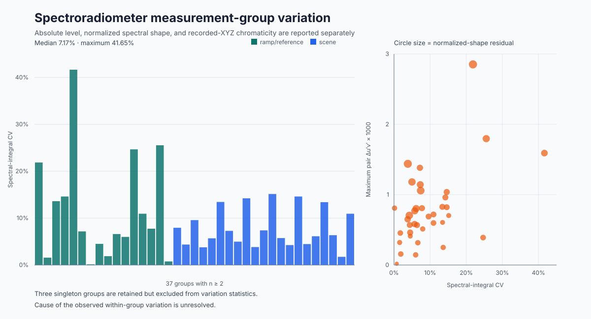

# Imaging and Color Measurement

Portfolio by [Fernando Voltolini de Azambuja](https://github.com/ferazambuja).

**[View the portfolio website](https://ferazambuja.github.io/imaging/)**
for the visual overview, investigation summaries, formulas, and selected C++
excerpts. This repository remains the technical source for the complete
studies, reports, public aggregates, and tested reference code.

I investigate how imaging systems record detail and color, how measurements
can guide engineering decisions, and how color transforms behave at their
numerical limits. The work combines camera and instrument measurements,
colorimetry, numerical methods, and small C++20 reference implementations.

Several measurement studies revisit retained laboratory captures. When a
missing control changes what a result can establish, the study explains the
limit and the experiment that would resolve it rather than hiding the gap
behind a result table. Deterministic studies state their modeled conditions
directly.

[Portfolio website](https://ferazambuja.github.io/imaging/) ·
[Study index](studies/README.md) ·
[Reports](reports/README.md) ·
[Methods](methods/README.md) ·
[Public data](data/README.md) ·
[Reference code](code/)

## Selected work

<table>
  <tr>
    <td width="50%" valign="top">
      <a href="studies/sfr-aperture-and-field.md"></a><br>
      <strong><a href="studies/sfr-aperture-and-field.md">Sharpness across aperture and frame</a></strong><br>
      <sub>Measured 299 slanted-edge regions and found that a single center value did not describe both capture systems.</sub>
    </td>
    <td width="50%" valign="top">
      <a href="studies/gamut-mapping.md"></a><br>
      <strong><a href="studies/gamut-mapping.md">Mapping wide-gamut color into sRGB</a></strong><br>
      <sub>Compared coordinate and algorithm choices while retaining a case where improving one severe error raised the grid average.</sub>
    </td>
  </tr>
  <tr>
    <td width="50%" valign="top">
      <a href="studies/spectral-sensitivity-and-color-fidelity.md"></a><br>
      <strong><a href="studies/spectral-sensitivity-and-color-fidelity.md">Can spectral sensitivity predict camera color?</a></strong><br>
      <sub>Tested measured sensitivities against chart captures, separating physical closure from theoretical fit quality.</sub>
    </td>
    <td width="50%" valign="top">
      <a href="studies/cfa-flat-field-response.md"></a><br>
      <strong><a href="studies/cfa-flat-field-response.md">What a uniform-field capture revealed</a></strong><br>
      <sub>Screened 52 sphere captures and showed that the accepted composite field could not be explained by a centered radial correction alone.</sub>
    </td>
  </tr>
</table>

## Featured investigations in depth

### [Is one center-sharpness number enough?](studies/sfr-aperture-and-field.md)

Slanted-edge measurements across aperture and image position compare two Nikon
capture systems. The study asks when a center MTF50 value represents the frame
and when field behavior makes that summary misleading.

Across **299 accepted regions**, the D810 center peaked cleanly at f/5.6 while
the D800 — same lens model, same chart — did not reproduce that trend and put
its field maximum off-axis at several apertures. Different focus methods and
uncontrolled lens identity, alignment, and field orientation keep this at
capture-session scope: the result supports separate field criteria, not a
camera-body or lens ranking.

### [Can measured sensor sensitivities predict color?](studies/spectral-sensitivity-and-color-fidelity.md)

Monochromator-derived spectral sensitivities are checked against separately
retained chart captures and against the CIE observer. The analysis separates a
physical closure test from the theoretical Luther-condition fit instead of
turning both into one camera ranking.

Across five measured sensitivity sets the ISO 17321-style index ranges from
**88.3 to 90.7** on the 18 chromatic-patch set, while mean CIEDE2000 spans
**0.88 to 1.10** under the same declared D55 calculation. The separate physical closure
check for four cameras predicted 140-patch captures to **9.5–13.8% RMS per
channel**. Closure tests those four sensitivity/capture paths; it is not a
ranking uncertainty, and it cannot validate the fifth camera's cross-rig
endpoint because that session has no paired closure capture.

### [Does a fitted color matrix generalize?](studies/colorchecker-ccm.md)

A linear RGB-to-XYZ color-correction matrix is evaluated on chart patches it
did not see during fitting. The result keeps compatible-reference uncertainty
and the dark-patch limitation visible rather than presenting one favorable
training score.

Held-out error exceeded training error by **0.035** CIEDE2000 (**4.134** against
**4.099**), showing little patch-fold overfit. Restricting the fit to lighter
patches produced a 22%-better headline while all-patch error remained **4.126**
and the excluded dark patches remained poorly predicted at **7.952**. The
result validates this fitting workflow against a compatible reference; it is
not a per-unit calibration.



### [What can an incomplete measurement archive still establish?](studies/spectroradiometer-recovery.md)

Archived spectroradiometer files are resolved by their contents and compared on
three separate axes: light level, normalized spectral shape, and chromaticity.
The analysis measures repeat variation while declining to invent a cause whose
acquisition conditions were not retained.

Content identity separated **89 distinct readings** from **45 byte-identical
aliases**; the retained grouping record then organized the readings into 40
groups. Median level variation was **7.17%**, the worst **41.65%** — and the
level maximum occurred in a different group from the shape and chromaticity
maxima, so the three axes cannot be collapsed into one stability score.



## Technical scope

The public reference layer is intentionally smaller than the private analysis
toolkit. The code published in this candidate currently covers eight coherent
numerical paths:

- color transforms, color differences, linear CCM fitting, and held-out
  evaluation;
- the slanted-edge SFR estimator from a decoder-independent, black-subtracted
  CFA image view: green-sample selection, edge localization, oversampled
  ESF/LSF construction, and MTF calculation;
- sampled-spectrum level and normalized-shape analysis, pointwise repeat
  statistics, recorded-XYZ chromaticity, and same-record spectral/XYZ closure
  under one fitted scale;
- physical sensitivity-to-chart closure, normalized Luther-condition quality,
  and ISO 17321-style sensitivity metamerism analysis;
- ideal-sRGB and Display-P3 transforms, analytic first-exit gamut boundaries,
  CIELAB and OkLCh radial mapping, Local MINDE, and an experimental protected
  core compressor;
- CFA-position headroom screening, center-normalized spatial and chromatic
  flat-field maps, equal-radius corner asymmetry, pair comparison, and bounded
  pedestal measurement;
- a bounded C++ study of selected CAM16-related brightness, background,
  coupled-chroma, and corrected colorfulness equations, linked to a standalone
  Python comparator for complete forward-model calculations;
- repeated-spectrum analysis on unequal native grids, common-support
  normalization, directional residual localization, diagnostic exclusions,
  and wavelength-offset sensitivity.

Archive discovery, private dataset configuration, RAW-file orchestration, and
report-generation machinery are not published. The repository is a portfolio
of scientific reasoning and selected reference implementations, not a
general-purpose camera-analysis product.

## Comparing CAM16 and Hellwig–Fairchild 2022

CAM16 does not turn XYZ into one universal description of appearance. It
combines the stimulus with an adopted white, adapting luminance, background,
and surround to predict six correlates: lightness `J`, brightness `Q`, chroma
`C`, colorfulness `M`, saturation `s`, and hue angle `h`.

The Hellwig–Fairchild 2022 proposal keeps `J` and `h` while redefining `Q`,
`C`, `M`, and `s`. A difference between its output and CAM16 is therefore a
comparison between formulations, not a color error, perceptual distance, or
proof that one better predicts observers.

The public [CAM16/Hellwig comparator](https://github.com/ferazambuja/cam16-hellwig-comparator)
accepts one XYZ sample or a CSV batch and returns either model or both as a
labelled table, CSV, or JSON record. It is one standard-library Python file
with no installation step. Use it when you want a dependency-free command-line
tool or labelled CSV and JSON output without installing a package. Projects
already using the Colour package should normally use Colour's maintained,
vectorized forward and inverse APIs. The [portfolio comparison](https://ferazambuja.github.io/imaging/#cam16-hellwig-comparator)
shows one generated example and connects it to the equation study.

## Building and running the tests

The reference layer needs only CMake 3.20 and a C++20 compiler. There are no
third-party dependencies to fetch.

```sh
cmake -B build -DCMAKE_BUILD_TYPE=Release
cmake --build build
ctest --test-dir build --output-on-failure
```

The tests are self-contained: they construct their inputs numerically and
assert against values derived in the linked method documents, so they run
without any capture, chart, or archive file. The same suite is also run under
AddressSanitizer and UndefinedBehaviorSanitizer.

## Sources and limits

The figures and aggregate tables needed to understand the findings are
published here. Original camera captures and source measurements remain
private; they are not needed to read the studies or run the public numerical
examples. When a historical gap changes what a result can establish, the
affected study explains the limitation and names the stronger experiment that
would resolve it.

Public tests exercise selected numerical methods with synthetic inputs. They
do not include original capture or instrument-file ingestion, and this
repository is not intended as a general-purpose camera-analysis product.

Code is licensed under the [MIT License](LICENSE-CODE). Original reports,
figures, and aggregate data in this repository are available under
[CC BY 4.0](LICENSE-CONTENT), except where a third-party notice states
otherwise.
