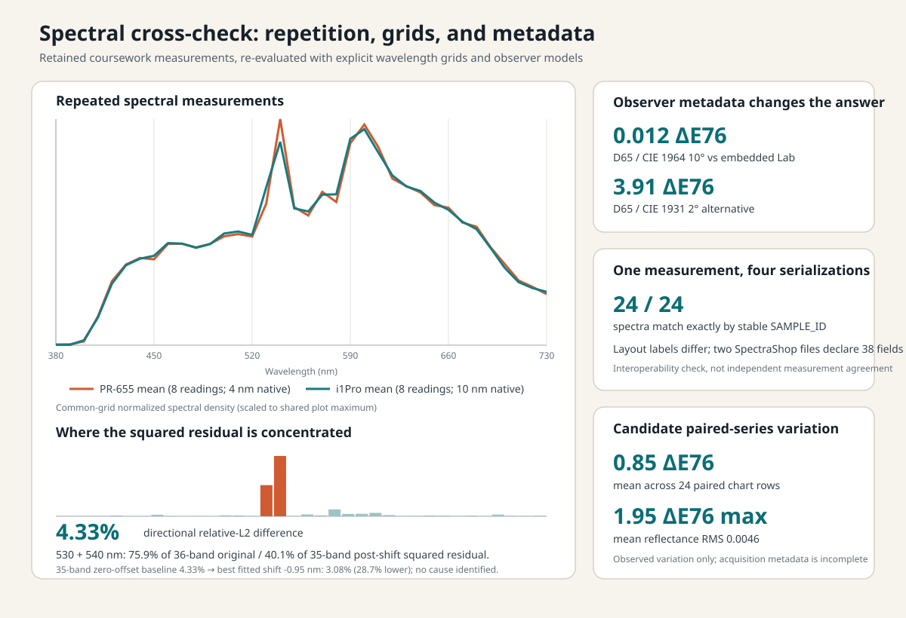
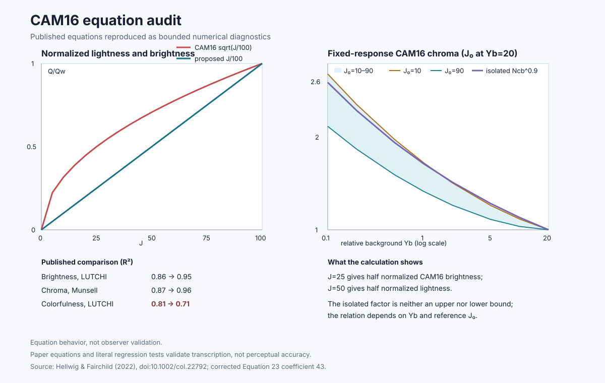

# Studies

These eight investigations cover measured camera systems, spectral and
instrument measurements, and deterministic color-model behavior. Every entry
states the question, the result, and the limitation that changes its interpretation; the full
study pages add the method and the experiment that would resolve what remains
unknown.

## Camera measurements

### [SFR/MTF across aperture and field](sfr-aperture-and-field.md)

Tests whether a center sharpness measurement represents the whole image and
keeps lens, focus, alignment, sensor sampling, and processing inside the stated
capture-system boundary.

[Study](sfr-aperture-and-field.md) · [report](../reports/sfr-mtf.md) · [method](../methods/slanted-edge-sfr.md)

Across 299 accepted regions the D810 center peaked cleanly at f/5.6 and exceeded
the strongest physical corner at three of its four mapped apertures. The D800
did not reproduce that trend and put its field maximum off-axis. Because focus,
lens identity, alignment, and field orientation were not controlled across the
sessions, the result supports separate field criteria for these captures rather
than a camera-body or lens ranking.

### [CFA flat-field response](cfa-flat-field-response.md)

Measures how a nominally uniform field changes across the sensor mosaic,
rejects near-clipped frames before analysis, and tests whether equal-radius
corners behave as a centered radial model predicts.

[Study](cfa-flat-field-response.md) ·
[report](../reports/flat-field-response.md) ·
[method](../methods/flat-field-response.md)

Only 3 of 52 sphere frames had usable headroom. Across those frames, four
corner blocks at equal distance from the center spread by **16.1–20.0%** of
their average. A field depending only on radius must give all four the same
value, so the centered radial model is excluded for each accepted field. The
archive cannot separate sphere, lens, alignment, and sensor contributions.

*A reduced view of the physical capture. Visible nonuniformity and the circular
structure at lower left help orient the setup; they are not used to infer the
result. The corner-spread figures above come from the retained sensor-mosaic
analysis, not from inspecting this image.*

### [ColorChecker extraction and CCM validation](colorchecker-ccm.md)

Fits a linear camera-RGB-to-XYZ matrix and evaluates it on held-out patches,
while distinguishing a compatible spectral reference from a per-unit chart
calibration.

[Study](colorchecker-ccm.md) · [report](../reports/ccm-fit.md) · [method](../methods/color-correction-matrix.md)

Held-out error was **4.134** mean CIEDE2000 against **4.099** training error,
a gap of 0.035 that shows little patch-fold overfit. Restricting the fit to
lighter patches produced a headline that looked 22% better while all-patch
error remained **4.126** and excluded dark-patch error was **7.952** — the
lower headline came from patch selection, not a better all-patch model.

## Spectral and instrument studies

### [Spectral sensitivity and camera color fidelity](spectral-sensitivity-and-color-fidelity.md)

Checks whether measured sensor sensitivities predict separately retained chart
captures and how closely their normalized subspace can approach the CIE
observer under a declared linear fit.

[Study](spectral-sensitivity-and-color-fidelity.md) · [report](../reports/spectral-sensitivity.md) · [method](../methods/spectral-fidelity.md)

Four cameras predicted their 140-patch chart captures to **9.5–13.8% RMS per
channel**. Across five measured sensitivity sets the SMI range on the 18
chromatic-patch set was **88.3 to 90.7**, while mean CIEDE2000 under the same
declared D55 calculation spanned **0.88 to 1.10**. Closure tests the four paired
sensitivity/capture paths; it is not a ranking uncertainty and does not validate
the fifth camera's cross-rig endpoint. The middle ordering also changes with
analysis choices and is not presented as a firm ranking.

### [Recovering spectroradiometer measurements](spectroradiometer-recovery.md)

Resolves ambiguous archived files by content and keeps light level, normalized
spectral shape, and chromaticity variation separate.

[Study](spectroradiometer-recovery.md) · [report](../reports/spectroradiometer-recovery.md) · [method](../methods/spectral-group-analysis.md)

Content identity separated **89 distinct readings** from **45 byte-identical
aliases**, and the retained grouping record organized the readings into 40
groups. Median within-group level variation was **7.17%** and the worst reached
**41.65%** — but the level maximum occurred in a different group from the
shape and chromaticity maxima, so no single stability number describes the
archive.

### [Spectral measurement cross-check](spectral-measurement-crosscheck.md)

Places two retained spectral series on a common wavelength grid, localizes
their disagreement, and tests contradictory observer metadata without
assigning an unrecorded physical cause.

[Study](spectral-measurement-crosscheck.md) ·
[report](../reports/spectral-measurement-crosscheck.md) ·
[method](../methods/spectral-comparison.md)

Two bands at 530 and 540 nm carry **75.9%** of the squared residual, and
dropping them takes the comparison from **4.327%** to **2.276%**. A fitted
wavelength offset lowers the objective by 28.7%, but it is fitted to the same
spectra it is scored against — a sensitivity result, not a located error.

## Deterministic color studies

### [Display-P3 to sRGB gamut mapping](gamut-mapping.md)

Compares four declared mapping methods on one synthetic color grid, exposing
the trade between severe local errors, average displacement, hue behavior, and
preserved distinctions.

[Study](gamut-mapping.md) · [report](../reports/gamut-mapping.md) ·
[method](../methods/gamut-mapping.md)

No method wins outright. Changing only the radial coordinate space reduced the
severe P3-yellow error from **23.928 to 5.523**, while grid mean rose from
**2.857 to 2.947**. Changing the OkLCh algorithm to Local MINDE then reduced
grid mean to **2.323** and the maximum to **7.602**, while widening the
90th-percentile IPT hue shift from **3.368° to 4.806°**.

### [Color-model equation audit](color-model-equation-audit.md)

Turns a bounded subset of published CAM16-related equations into numerical
checks, preserving favorable and unfavorable consequences without presenting
it as a full model or observer study. A separate Python companion makes both
forward formulations reusable without turning model output into observer
validation.

[Study](color-model-equation-audit.md) ·
[report](../reports/cam16-equation-audit.md) ·
[audit method](../methods/cam16-equation-audit.md) ·
[standalone comparator](https://github.com/ferazambuja/cam16-hellwig-comparator)

An isolated background term reaches **2.595×**, while the complete coupled
expression spans **2.120–2.687×** — crossing that value from both sides. The
isolated factor is therefore neither a lower nor an upper bound on the complete
expression under this declared equation sweep.

