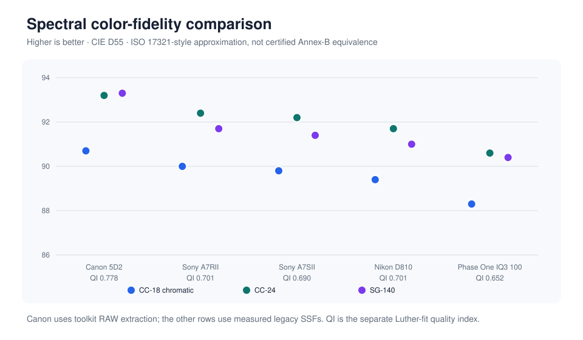

# What do a camera’s spectral sensitivities say about its color fidelity?

A camera does not record color directly. Its red, green, and blue channels each
respond to a broad range of wavelengths, and many different spectra can produce
the same three channel values. A 3×3 color matrix can align those responses with
standard color coordinates, but it cannot recover distinctions that the sensor
never recorded.

This study uses retained spectral-sensitivity measurements to ask three
questions. Can the sensitivities predict a separately captured color chart? How
closely does their three-dimensional subspace approach the CIE standard
observer? And after fitting the best linear color transform, how much chart
error remains?

Across five measured sensitivity sets the ISO 17321-style index ranges from
**88.3 to 90.7** on the 18 chromatic patches, and four of the cameras predicted
their paired 140-patch captures to **9.5–13.8% RMS per channel**. The fifth has
no paired capture, so its closure cells stay empty rather than being filled by
inference.

[Detailed report](../reports/spectral-sensitivity.md) ·
[Method and formulas](../methods/spectral-fidelity.md) ·
[Published aggregate](../data/spectral-color-fidelity.csv) ·
[Validation controls](../data/spectral-fidelity-controls.csv) ·
[Reference code](../code/)

*Each group contains three ISO 17321-style sensitivity metamerism index (SMI)
values: the 18 chromatic ColorChecker patches, the full 24-patch chart, and the
140-patch ColorChecker SG. The vertical axis is truncated to 86–94, so it makes
small numeric differences look visually large. The `QI` label is a separate
Luther-condition quality index; it is not another SMI value. Higher is better
for both indices, but they answer different questions. The footnote records the
sensitivity-source split discussed below: the Canon curves were re-extracted
from RAW, the others are retained measured curves.*

## Why the archive needs three tests

The retained material is uneven. Four cameras share the laboratory run for
which sensitivity curves, a measured illuminant, chart reflectances, and a
paired broadband chart capture all survived. Those records permit a physical
closure test: predict the chart response from the sensitivities and compare it
with what the camera measured.

The Phase One IQ3 sensitivity set came from another rig. It has no paired chart
capture in the retained records, so its closure cells are deliberately empty.
It can participate in the mathematical sensitivity comparisons, but not in the
physical closure experiment.

That separation matters. A good sensitivity-to-observer fit does not prove that
the measurement chain predicts a real capture. Conversely, closure residuals
include the illuminant, reflectance, capture, and sensitivity records; they are
not a pure score of the sensor.

## What was calculated

### 1. Physical closure

For each of the four fully paired camera paths, the measured sensitivities,
illuminant, and 140 patch reflectances predict camera RGB. A white-card ratio
check runs first. The chart comparison then fits one exposure scale across all
patches and all three channels. Separate channel scales would conceal the
spectral disagreement the test is intended to expose.

### 2. Luther-condition quality

The camera’s three sensitivity curves are treated as a vector subspace. Each
CIE 1931 color-matching function is fitted from that subspace, and the normalized
residuals are combined into a quality index with a ceiling of 1. This isolates
the geometric match between the measured sensor and observer subspaces; it does
not include a chart, illuminant, exposure, or noise model.

### 3. ISO 17321-style SMI

The sensitivities synthesize camera RGB for declared reflectance sets under
D55. A 3×3 RGB-to-XYZ matrix is fitted, the remaining CIELAB color differences
are measured, and SMI is calculated as
`100 − 5.5 × mean ΔE76`. CIEDE2000 is retained as a separate diagnostic. It is
not converted to SMI and is not the same error scale.

## Results

| Camera | CC18 SMI | Mean CIEDE2000, CC18 | Luther quality | 140-patch closure RMS by channel |
| --- | ---: | ---: | ---: | --- |
| Canon 5D2 | 90.7 | 0.93 | 0.778 | 9.539% / 9.840% / 11.618% |
| Sony A7RII | 90.0 | 0.97 | 0.701 | 10.803% / 11.149% / 13.349% |
| Sony A7SII | 89.8 | 0.88 | 0.690 | 9.901% / 9.917% / 11.252% |
| Nikon D810 | 89.4 | 1.07 | 0.701 | 10.802% / 11.069% / 13.802% |
| Phase One IQ3 100 | 88.3 | 1.10 | 0.652 | not available |

Across the five sensitivity sets, CC18 SMI ranges from **88.3 to 90.7** and mean
CIEDE2000 spans **0.88 to 1.10** under the declared D55 calculation. No observer
experiment or viewing condition in this archive turns the latter range into a
universal visibility threshold.

The methods do not produce one interchangeable ranking. The Canon row has the
highest CC18 SMI and Luther quality, while the A7SII has the lowest mean
CIEDE2000. A7RII and D810 share a Luther quality of **0.701** despite different
SMI and CIEDE2000 values. Those differences are useful because they show what
each metric responds to; combining them into one score would discard that
information.

For the four paired paths, the twelve channel closure residuals span
**9.539% to 13.802% RMS**. Minimum channel correlation remains above **0.992**,
but correlation is the weaker result: the 140-patch chart’s large light-to-dark
range can preserve ordering even when the response magnitude is wrong. The RMS
residual is therefore reported alongside it.

## What can and cannot be concluded

Within the shared four-camera run, the Canon sensitivity set is the closest to
the observer under the declared Luther and SMI calculations. The Phase One
value extends the comparison, but it is a directional cross-rig endpoint, not a
controlled fifth-camera ranking. The missing overlap means its difference from
the shared run cannot be separated from apparatus, wavelength registration,
source, geometry, or processing differences.

Two Phase One sweeps were retained, and the last-place result appears under
both. They differ by roughly **0.1 SMI**, and the camera stays last under either
run by both the Luther and the SMI calculation. That is a two-run spread on one
rig: it shows that this result does not depend on selecting one of those two
retained sweeps, but it bounds nothing about the offset between the two rigs,
which remains the larger unknown. The report's
[Phase One addendum](../reports/spectral-sensitivity.md#addendum--what-the-phase-one-records-can-and-cannot-establish)
sets out which questions those records answer, which one they block, and why
the blocked one needs a measurement rather than more analysis.

One asymmetry sits inside the winning row itself. Canon's sensitivity curves
were re-extracted from the monochromator RAW captures by this project's
pipeline, while the other four rows are curves measured and retained at the
time — so the top-ranked row reached the table by a different processing path
than its comparators. That was checked rather than assumed: extractions run the
same way for the other three shared-run cameras preserved the Canon and A7SII
endpoints, while the D810/A7RII middle pair remained effectively tied and
exchanged places at higher precision. For Canon, the retained
channel-by-channel comparison between toolkit and legacy curves reaches a
normalized response correlation of 0.9993 or better. These controls reduce the
chance that curve selection created the ordering; they do not prove that either
curve set is physically correct. The table remains mixed-source, and the
[report](../reports/spectral-sensitivity.md) states what that does and does not
bound.

The closure result shows the narrower point that the four retained
sensitivity/capture chains predict their paired 140-patch responses to the
reported residuals under one global scale. It does not establish calibration
accuracy, an uncertainty bound, or which input contributes most to the error.

## What a stronger experiment would add

The preferred experiment would measure every camera on the same documented
monochromator and chart setup, repeat the sensitivity sweeps, monitor the source,
record dark and pedestal procedures, verify wavelength and bandwidth, and pair
each sensitivity set with the same illuminant, physical chart, and broadband
capture. Interleaving repeated measurements would support a within-session
uncertainty estimate instead of relying on isolated historical runs.

The incomplete archive still answers useful questions because the missing
links are kept visible. It shows both what can be recovered from retained
measurements and exactly which new acquisition would turn a directional
comparison into a controlled one.
